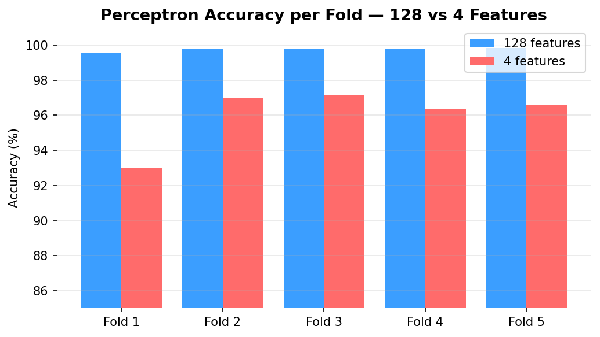

# Binary Classification with the Perceptron Algorithm

Implementation of the Perceptron algorithm from scratch applied to a binary 
classification task on 16,000 samples with 128 features. Evaluated using 
5-fold cross-validation on both the original and wavelet-reduced feature spaces.

## How to Run
1. Create a virtual environment: `python -m venv venv`
2. Activate it: `venv\Scripts\activate` (Windows) or `source venv/bin/activate` (Mac/Linux)
3. Install dependencies: `pip install -r requirements.txt`
4. Place `data.txt` inside a `data/` folder
5. Run: `jupyter notebook assignment_2.ipynb`

## Results

| Space | Fold 1 | Fold 2 | Fold 3 | Fold 4 | Fold 5 | Avg |
|---|---|---|---|---|---|---|
| 128 features | 99.5% | 99.8% | 99.8% | 99.8% | 99.8% | **99.7%** |
| 4 features | 93.0% | 97.0% | 97.2% | 96.3% | 96.6% | 96.0% |

## Usage
This pipeline can be applied to any binary classification problem. 
The Perceptron implementation is reusable across datasets — simply 
replace the data file and adjust the learning rate and max iterations.
